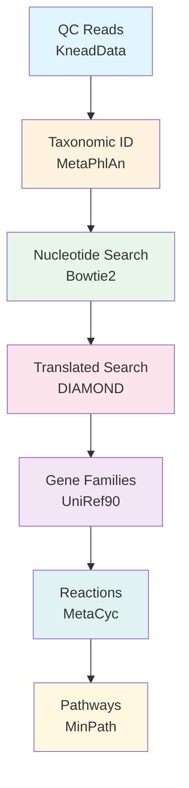

# 🧬 HUMAnN4 Functional Profiling Pipeline

[](https://github.com/biobakery/humann)
[](https://github.com/biobakery/MetaPhlAn)
[](https://opensource.org/licenses/MIT)

> Functional profiling workflow for pig gut shotgun metagenomic data using HUMAnN4

## 📋 Table of Contents

- [Overview](#overview)
- [Pipeline Workflow](#pipeline-workflow)
- [Requirements](#requirements)
- [Installation](#installation)
- [Usage](#usage)
- [Output Files](#output-files)
- [R Integration](#r-integration)
- [Visualization](#visualization)
- [Troubleshooting](#troubleshooting)
- [References](#references)

---

## Overview

**HUMAnN** (HMP Unified Metabolic Analysis Network) profiles the abundance of microbial metabolic pathways and molecular functions from metagenomic sequencing data. This pipeline processes quality-controlled reads through taxonomic identification, gene family quantification, and pathway reconstruction.

### Key Features

- 🔬 **Organism-specific profiling** - Links functions to specific taxa
- 📊 **Multiple output formats** - Gene families, pathways, EC numbers, KOs
- 🔄 **Stratified analysis** - Community-level and per-species contributions
- 📈 **Built-in visualization** - Barplots for pathway abundance

---

## Pipeline Workflow



| Step | Tool | Purpose | Output |
|:----:|:----:|:--------|:-------|
| 1 | MetaPhlAn | Identify community species | Species profile |
| 2 | Bowtie2 | Map reads to pangenomes | Nucleotide alignments |
| 3 | DIAMOND | Align unmapped reads to proteins | Protein alignments |
| 4 | HUMAnN | Quantify gene families | `*_genefamilies.tsv` |
| 5 | HUMAnN | Reconstruct pathways | `*_pathabundance.tsv` |

---

## Requirements

### System Requirements

| Resource | Minimum | Recommended |
|:---------|:-------:|:-----------:|
| **RAM** | 32 GB | 64 GB |
| **Disk** | 50 GB | 100 GB |
| **CPUs** | 8 | 16 |
| **Time/sample** | 30 min | 20 min |

### Software Dependencies

- Python ≥ 3.10
- MetaPhlAn ≥ 4.0
- Bowtie2 ≥ 2.2
- DIAMOND ≥ 2.0
- MinPath

---

## Installation

### 1. Create Conda Environment

```bash
# Create dedicated environment
mamba create -n humann4_env -c biobakery -c conda-forge -c bioconda \
    python=3.10 humann metaphlan -y

# Activate
mamba activate humann4_env

# Verify
humann --version
metaphlan --version
```

### 2. Install Databases

```bash
# Set database directory
DB_DIR="/path/to/humann4_dbs"
mkdir -p $DB_DIR

# MetaPhlAn database
metaphlan --install --force_download

# HUMAnN databases
humann_databases --download chocophlan full $DB_DIR/
humann_databases --download uniref uniref90_diamond $DB_DIR/
humann_databases --download utility_mapping full $DB_DIR/

# Configure paths
humann_config --update database_folders nucleotide $DB_DIR/chocophlan
humann_config --update database_folders protein $DB_DIR/uniref
humann_config --update database_folders utility_mapping $DB_DIR/utility_mapping

# Verify
humann_config --print
```

### 3. Test Installation

```bash
humann_test
```

---

## Usage

### Directory Structure

```
project/
├── 📁 data/
│   ├── 📁 clean/                    # Input (QC reads)
│   │   ├── sample1_paired_1.fastq
│   │   └── sample1_paired_2.fastq
│   ├── 📁 humann4/                  # Output
│   │   ├── 📁 sample1/
│   │   ├── 📁 all_outputs/
│   │   ├── 📁 merged/
│   │   └── 📁 R_input/
│   └── 📁 refs/
│       └── 📁 humann4_dbs/
├── 📁 config/
│   ├── samples.txt
│   └── sample_metadata.csv
└── 📁 scripts/
    ├── humann4_batch.sbatch
    └── humann4_to_csv.py
```

### Single Sample

```bash
# Concatenate paired reads (HUMAnN4 requirement)
cat sample_R1.fastq sample_R2.fastq > sample_concat.fastq

# Run HUMAnN4
humann --input sample_concat.fastq \
    --output output_dir \
    --threads 16 \
    --output-basename sample

# Cleanup
rm sample_concat.fastq
```

### Batch Processing (SLURM)

<details>
<summary>📄 Click to expand SLURM script</summary>

```bash
#!/bin/bash
#SBATCH --job-name=humann4
#SBATCH --output=humann4_%A_%a.out
#SBATCH --error=humann4_%A_%a.err
#SBATCH --partition=msismall
#SBATCH --cpus-per-task=16
#SBATCH --mem=64G
#SBATCH --time=24:00:00
#SBATCH --array=1-30
#SBATCH --mail-type=BEGIN,END,FAIL
#SBATCH --mail-user=your@email.edu

# Initialize conda
source ~/.bashrc
eval "$(conda shell.bash hook)"
conda activate humann4_env

# Paths
CLEAN_DIR="data/clean"
OUT_DIR="data/humann4"
SAMPLE_LIST="config/samples.txt"

SAMPLE=$(sed -n "${SLURM_ARRAY_TASK_ID}p" $SAMPLE_LIST)

echo "Processing: ${SAMPLE} | Start: $(date)"

# Concatenate and run
cat ${CLEAN_DIR}/${SAMPLE}_paired_1.fastq \
    ${CLEAN_DIR}/${SAMPLE}_paired_2.fastq > ${OUT_DIR}/${SAMPLE}_concat.fastq

humann --input ${OUT_DIR}/${SAMPLE}_concat.fastq \
    --output ${OUT_DIR}/${SAMPLE} \
    --threads 16 \
    --output-basename ${SAMPLE}

rm ${OUT_DIR}/${SAMPLE}_concat.fastq
echo "Completed: ${SAMPLE} | End: $(date)"
```

</details>

### Post-Processing

```bash
# 1. Copy outputs to single directory
mkdir -p data/humann4/all_outputs
cp data/humann4/*/*_genefamilies.tsv data/humann4/all_outputs/
cp data/humann4/*/*_pathabundance.tsv data/humann4/all_outputs/
cp data/humann4/*/*_pathcoverage.tsv data/humann4/all_outputs/

# 2. Merge tables
OUT="data/humann4/all_outputs"
MERGED="data/humann4/merged"
mkdir -p $MERGED

humann_join_tables -i $OUT -o $MERGED/all_genefamilies.tsv --file_name genefamilies
humann_join_tables -i $OUT -o $MERGED/all_pathabundance.tsv --file_name pathabundance
humann_join_tables -i $OUT -o $MERGED/all_pathcoverage.tsv --file_name pathcoverage

# 3. Normalize
humann_renorm_table -i $MERGED/all_genefamilies.tsv -o $MERGED/all_genefamilies_relab.tsv -u relab
humann_renorm_table -i $MERGED/all_pathabundance.tsv -o $MERGED/all_pathabundance_relab.tsv -u relab

# 4. Regroup to functional categories
humann_regroup_table -i $MERGED/all_genefamilies.tsv -o $MERGED/all_ecs.tsv -g uniref90_level4ec
humann_regroup_table -i $MERGED/all_genefamilies.tsv -o $MERGED/all_kos.tsv -g uniref90_ko

# 5. Add human-readable names
humann_rename_table -i $MERGED/all_ecs.tsv -o $MERGED/all_ecs_named.tsv -n ec
humann_rename_table -i $MERGED/all_kos.tsv -o $MERGED/all_kos_named.tsv -n kegg-orthology

# 6. Split stratified tables
humann_split_stratified_table -i $MERGED/all_pathabundance.tsv -o $MERGED
humann_split_stratified_table -i $MERGED/all_genefamilies.tsv -o $MERGED
```

---

## Output Files

### Per-Sample Outputs

| File | Description | Units |
|:-----|:------------|:------|
| `*_genefamilies.tsv` | Gene family abundances | RPK |
| `*_pathabundance.tsv` | Pathway abundances | RPK |
| `*_pathcoverage.tsv` | Pathway coverage | 0-1 |

### Merged Outputs

| File | Description |
|:-----|:------------|
| `all_genefamilies.tsv` | Combined gene families |
| `all_genefamilies_relab.tsv` | Relative abundance |
| `all_pathabundance.tsv` | Combined pathways |
| `all_pathabundance_unstratified.tsv` | Community totals only |
| `all_pathabundance_stratified.tsv` | Species contributions |
| `all_ecs_named.tsv` | EC numbers with names |
| `all_kos_named.tsv` | KEGG orthologs with names |

### Output Format

```
# Stratified format example
# Gene Family                                    Sample1    Sample2
UNMAPPED                                         22236      18542
UniRef90_A0A009Z9G8                              1234.5     987.3
UniRef90_A0A009Z9G8|g__Lactobacillus.s__L_john   800.3      654.2
UniRef90_A0A009Z9G8|unclassified                 434.2      333.1
```

---

## R Integration

### Convert to CSV

```python
#!/usr/bin/env python3
"""Convert HUMAnN4 outputs to R-ready CSV."""
import pandas as pd
import os

merged = "data/humann4/merged"
output = "data/humann4/R_input"
os.makedirs(output, exist_ok=True)

def process(infile, outfile):
    df = pd.read_csv(infile, sep='\t', index_col=0)
    # Clean sample names
    df.columns = [c.replace('_Abundance-RPKs', '').replace('_pathabundance', '') 
                  for c in df.columns]
    # Remove special rows and stratified
    df = df[~df.index.isin(['UNMAPPED', 'UNINTEGRATED', 'UNGROUPED'])]
    df = df[~df.index.str.contains('\\|', regex=True)]
    df.to_csv(outfile)

process(f"{merged}/all_pathabundance.tsv", f"{output}/pathways.csv")
process(f"{merged}/all_ecs_named.tsv", f"{output}/ecs.csv")
process(f"{merged}/all_kos_named.tsv", f"{output}/kos.csv")
```

### Load in R

```r
library(tidyverse)

# Load data
pathways <- read.csv("data/humann4/R_input/pathways.csv", row.names=1)
ecs <- read.csv("data/humann4/R_input/ecs.csv", row.names=1)
kos <- read.csv("data/humann4/R_input/kos.csv", row.names=1)

# Summary
cat("Pathways:", nrow(pathways), "x", ncol(pathways), "\n")
cat("ECs:", nrow(ecs), "x", ncol(ecs), "\n")
cat("KOs:", nrow(kos), "x", ncol(kos), "\n")

# Top pathways
head(sort(rowSums(pathways), decreasing=TRUE), 10)
```

---

## Visualization

### HUMAnN Barplots

```bash
# Add metadata for plotting
# Create PCL file with metadata rows

humann_barplot \
    --input all_pathabundance_meta.pcl \
    --focal-feature "PWY-5022" \
    --focal-metadata Group \
    --last-metadata Group \
    --output pathway_barplot.png \
    --sort sum metadata \
    --scaling logstack \
    --as-genera
```

### Example Output

```
Pathway: L-arginine biosynthesis (PWY-5022)

Sample sorted by abundance and grouped by treatment:

█████████████████████████  Control_1   (L. johnsonii)
████████████████████       Control_2   (L. reuteri)
██████████████             Treatment_1 (Mixed)
████████                   Treatment_2 (Unclassified)
```

---

## Troubleshooting

<details>
<summary>❌ <b>humann: command not found</b></summary>

```bash
# Initialize conda properly
source ~/.bashrc
eval "$(conda shell.bash hook)"
conda activate humann4_env
which humann
```

</details>

<details>
<summary>❌ <b>Zero tables to join</b></summary>

```bash
# Files must be in same directory
# Copy all outputs first
cp data/humann4/*/*_genefamilies.tsv data/humann4/all_outputs/
humann_join_tables -i data/humann4/all_outputs -o merged.tsv --file_name genefamilies
```

</details>

<details>
<summary>❌ <b>Database errors</b></summary>

```bash
# Verify configuration
humann_config --print

# Re-download if needed
humann_databases --download chocophlan full $DB_DIR/ --update-config yes
```

</details>

<details>
<summary>❌ <b>Out of memory</b></summary>

```bash
# Reduce threads
humann --input file.fastq --output out --threads 8

# Or skip translated search
humann --input file.fastq --output out --bypass-translated-search
```

</details>

---

## Parameters Reference

| Parameter | Default | Description |
|:----------|:-------:|:------------|
| `--threads` | 1 | CPU threads |
| `--output-basename` | input | Output file prefix |
| `--bypass-translated-search` | False | Skip DIAMOND search |
| `--bypass-nucleotide-search` | False | Skip Bowtie2 search |
| `--prescreen-threshold` | 0.01 | Min abundance for pangenome |
| `--nucleotide-identity-threshold` | 0.0 | Min identity (nucleotide) |
| `--translated-identity-threshold` | 50.0 | Min identity (protein) |
| `--nucleotide-subject-coverage-threshold` | 50.0 | Min coverage (nucleotide) |
| `--translated-subject-coverage-threshold` | 50.0 | Min coverage (protein) |

---

## References

### Citation

If you use HUMAnN in your research, please cite:

```bibtex
@article{beghini2021integrating,
  title={Integrating taxonomic, functional, and strain-level profiling 
         of diverse microbial communities with bioBakery 3},
  author={Beghini, Francesco and McIver, Lauren J and Blanco-M{\'i}guez, Aitor 
          and Dubois, Leonard and Asnicar, Francesco and Maharjan, Sagun 
          and Mailyan, Ana and Manghi, Paolo and Scholz, Matthias 
          and Thomas, Andrew M and others},
  journal={eLife},
  volume={10},
  pages={e65088},
  year={2021},
  publisher={eLife Sciences Publications Limited}
}
```

### Resources

- 📖 [HUMAnN Wiki](https://github.com/biobakery/humann/wiki)
- 📖 [HUMAnN Tutorial](https://github.com/biobakery/biobakery/wiki/humann4)
- 📖 [MetaCyc Database](https://metacyc.org/)
- 📖 [UniRef Database](https://www.uniprot.org/uniref/)
- 📖 [bioBakery Forum](https://forum.biobakery.org/)

---

## License

This pipeline documentation is released under the [MIT License](LICENSE).

---

<p align="center">
  <i>Part of the Pig Gut Metagenomics Project</i><br>
  <i>University of Minnesota</i>
</p>
