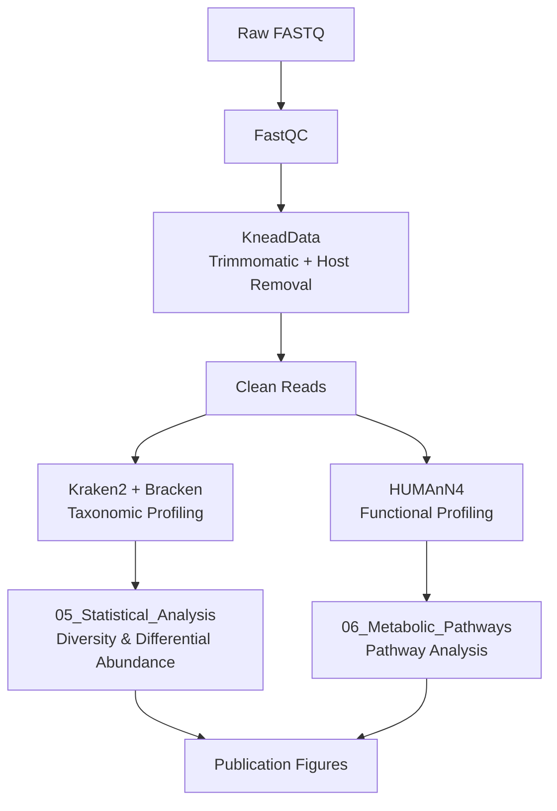

# 🐷 Pig Metagenomics Pipeline

[](https://opensource.org/licenses/MIT)
[](https://snakemake.readthedocs.io)
[](https://doi.org/)

> A comprehensive shotgun metagenomics pipeline for pig gut microbiome analysis: from raw reads to taxonomic profiles, functional annotations, and statistical analysis.

---

## 📋 Table of Contents

- [Overview](#overview)
- [Pipeline Workflow](#pipeline-workflow)
- [Directory Structure](#-directory-structure)
- [Installation](#installation)
- [Pipeline Steps](#pipeline-steps)
- [Documentation](#documentation)
- [Citation](#citation)

---

## Overview

This pipeline processes shotgun metagenomic sequencing data from pig gut samples through quality control, taxonomic profiling, functional annotation, and comprehensive statistical analysis.

| Step | Tool | Purpose |
|------|------|---------|
| 1. Quality Control | FastQC, MultiQC | Assess raw read quality |
| 2. Preprocessing | KneadData (Trimmomatic) | Trim adapters, filter low-quality reads |
| 3. Host Removal | KneadData (Bowtie2) | Remove pig genome contamination |
| 4. Taxonomic Profiling | Kraken2 + Bracken | Identify and quantify microbial species |
| 5. Functional Profiling | HUMAnN4 | Predict metabolic pathways |
| 6. Statistical Analysis | R (ALDEx2, ANCOM-BC) | Diversity and differential abundance |

### Project Stats

```
📊 Samples:     30 pig gut metagenomes
🧬 Sequencing:  Paired-end Illumina (Nextera)
💾 Raw Data:    ~15 GB
🖥️ Platform:    MSI (Minnesota Supercomputing Institute)
```

---

## Pipeline Workflow



---

## 📁 Directory Structure

```
Metagenomics_Pipeline_Pigs_Complex_Diets/
│
├── 📄 README.md                          # This file
├── 📄 LICENSE                            # MIT License
│
├── 📂 docs/                              # Step-by-step documentation
│   ├── 01_pig_genome_index.md            # Build Bowtie2 index for host removal
│   ├── 02_QC_and_Host_Removal.md         # KneadData preprocessing
│   ├── 03_Taxonomic_Kraken2.md           # Kraken2 + Bracken profiling
│   └── 04_Humann4.md                     # HUMAnN4 functional profiling
│
├── 📂 05_Statistical_Analysis/           # R analysis scripts and reports
│   ├── README.md                         # Analysis documentation
│   ├── complex_diets.qmd                 # Quarto source file
│   ├── complex_diets.html                # Rendered HTML report
│   ├── meta.csv                          # Sample metadata
│   └── merged_*_abundance.txt            # Bracken abundance tables
│
├── 📂 06_Metabolic_Pathways/             # HUMAnN4 pathway analysis (coming soon)
│   └── README.md
│
├── 📂 scripts/                           # Pipeline scripts
│   ├── 00_prepare_env.sh
│   ├── 01_download_genome.sh
│   ├── 02_build_index.sbatch
│   ├── 03_kneaddata.sbatch
│   ├── 04_kraken2_batch.sbatch
│   ├── 05_bracken_batch.sbatch
│   └── 06_humann4_batch.sbatch
│
├── 📂 envs/                              # Conda environments
│   └── pig_metagenomics.yml
│
└── 📂 config/                            # Configuration files
    └── samples.txt
```

---

## Installation

### 1. Clone Repository

```bash
git clone https://github.com/SudarioRoberto/Metagenomics_Pipeline_Pigs_Complex_Diets.git
cd Metagenomics_Pipeline_Pigs_Complex_Diets
```

### 2. Create Conda Environment

```bash
mamba env create -f envs/pig_metagenomics.yml
mamba activate pig_metagenomics
```

### 3. Download Databases

```bash
# Pig genome for host removal
bash scripts/01_download_genome.sh

# Kraken2 standard database
# See docs/03_Taxonomic_Kraken2.md for details

# HUMAnN4 databases
# See docs/04_Humann4.md for details
```

---

## Pipeline Steps

### Step 1: Build Host Genome Index

Build Bowtie2 index for pig genome (Sus scrofa) to remove host contamination.

```bash
sbatch scripts/02_build_index.sbatch
```

📖 **Documentation:** [01_pig_genome_index.md](01_pig_genome_index.md)

---

### Step 2: Quality Control & Host Removal

Run KneadData for adapter trimming, quality filtering, and host decontamination.

```bash
sbatch scripts/03_kneaddata.sbatch
```

📖 **Documentation:** [02_QC_and_Host_Removal.md](02_QC_and_Host_Removal.md)

---

### Step 3: Taxonomic Profiling

Classify reads taxonomically using Kraken2 and refine abundances with Bracken.

```bash
sbatch scripts/04_kraken2_batch.sbatch
sbatch scripts/05_bracken_batch.sbatch
```

📖 **Documentation:** [03_Taxonomic_Kraken2.md](03_Taxonomic_Kraken2.md)

---

### Step 4: Functional Profiling

Profile metabolic pathways and gene families using HUMAnN4.

```bash
sbatch scripts/06_humann4_batch.sbatch
```

📖 **Documentation:** [04_Humann4.md](04_Humann4.md)

---

### Step 5: Statistical Analysis

Comprehensive statistical analysis in R including:

- **Alpha diversity**: Observed, Shannon, Simpson, Chao1, Pielou's evenness
- **Beta diversity**: PCoA with Bray-Curtis, Jaccard, Aitchison distances
- **PERMANOVA**: Test for treatment effects
- **Differential abundance**: ALDEx2 and ANCOM-BC with consensus approach

📖 **Documentation:** [05_Statistical_Analysis/README.md](05_Statistical_Analysis/README.md)

🔗 **Interactive Report:** [View Full Analysis](https://sudarioroberto.github.io/Metagenomics_Pipeline_Pigs_Complex_Diets/)

---

### Step 6: Metabolic Pathway Analysis

*Coming soon* - Analysis of HUMAnN4 pathway and gene family outputs.

📖 **Documentation:** [06_Metabolic_Pathways/README.md](06_Metabolic_Pathways/README.md)

---

## Documentation

| Document | Description |
|----------|-------------|
| [01_pig_genome_index.md](01_pig_genome_index.md) | Download pig genome, build Bowtie2 index |
| [02_QC_and_Host_Removal.md](02_QC_and_Host_Removal.md) | KneadData preprocessing workflow |
| [03_Taxonomic_Kraken2.md](03_Taxonomic_Kraken2.md) | Kraken2 + Bracken taxonomic profiling |
| [04_Humann4.md](04_Humann4.md) | HUMAnN4 functional profiling |
| [05_Statistical_Analysis/README.md](05_Statistical_Analysis/README.md) | R statistical analysis guide |

---

## 🛠️ Troubleshooting

<details>
<summary><b>Java OutOfMemoryError (Trimmomatic)</b></summary>

Add to your script:
```bash
export _JAVA_OPTIONS="-Xmx32g"
```
</details>

<details>
<summary><b>Bowtie2 not found</b></summary>

Use full path to bin directory:
```bash
--bowtie2 /path/to/conda/env/bin
```
</details>

<details>
<summary><b>Kraken2 database loading errors</b></summary>

Use memory mapping if RAM is limited:
```bash
kraken2 --db $DB --memory-mapping --paired ...
```
</details>

<details>
<summary><b>HUMAnN4 command not found</b></summary>

Initialize conda properly:
```bash
source ~/.bashrc
eval "$(conda shell.bash hook)"
conda activate humann4_env
```
</details>

---

## Citation

If you use this pipeline, please cite:

```bibtex
@software{pig_metagenomics_pipeline,
  author = {Sudario, Roberto},
  title = {Pig Metagenomics Pipeline},
  year = {2024},
  url = {https://github.com/SudarioRoberto/Metagenomics_Pipeline_Pigs_Complex_Diets}
}
```

### Tools Used

| Tool | Purpose | Citation |
|------|---------|----------|
| [KneadData](https://huttenhower.sph.harvard.edu/kneaddata/) | Quality control and host removal | Huttenhower Lab |
| [Kraken2](https://github.com/DerrickWood/kraken2) | Taxonomic classification | Wood et al., 2019 |
| [Bracken](https://github.com/jenniferlu717/Bracken) | Abundance estimation | Lu et al., 2017 |
| [HUMAnN4](https://github.com/biobakery/humann) | Functional profiling | Beghini et al., 2021 |
| [ALDEx2](https://github.com/ggloor/ALDEx2) | Differential abundance | Fernandes et al., 2014 |
| [ANCOM-BC](https://github.com/FrederickHuangLin/ANCOMBC) | Differential abundance | Lin & Peddada, 2020 |

---

## 📝 License

This project is licensed under the MIT License - see the [LICENSE](LICENSE) file for details.
